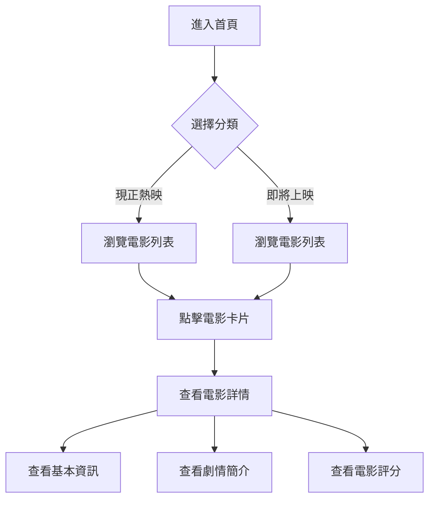

# 電影時刻 APP 使用者流程

## 當前功能流程

## 待開發的 User Story

### 搜尋功能
- 身為使用者，我想要能夠搜尋電影名稱，以便快速找到我感興趣的電影。
- 身為使用者，我想要在搜尋時看到即時建議，以便更快找到目標電影。

### 分類篩選
- 身為使用者，我想要根據電影類型（如動作、喜劇、劇情等）篩選電影，以便找到符合我喜好的電影。
- 身為使用者，我想要能夠組合多個篩選條件（如類型+評分），以便更精確地找到想看的電影。

### 分頁功能
- 身為使用者，我想要能夠載入更多電影，以便瀏覽完整的電影列表。
- 身為使用者，我想要知道當前瀏覽進度（如第幾頁/共幾頁），以便了解還有多少內容可以瀏覽。

### 收藏功能
- 身為使用者，我想要能夠收藏感興趣的電影，以便之後快速找到。
- 身為使用者，我想要管理我的收藏清單，以便整理我想看的電影。

## 優先級排序

1. 搜尋功能（High）：這是用戶最基本的需求，能夠快速找到想看的電影。
2. 分頁功能（High）：確保用戶能夠瀏覽所有電影內容。
3. 分類篩選（Medium）：幫助用戶更好地探索電影。
4. 收藏功能（Low）：增加用戶黏著度的附加功能。

## 技術需求

1. 搜尋功能
   - 實作即時搜尋（Debounce 處理）
   - 搜尋結果快取機制
   - 搜尋歷史記錄

2. 分頁功能
   - 無限滾動或分頁按鈕
   - 載入狀態處理
   - 錯誤重試機制

3. 分類篩選
   - 多重篩選邏輯
   - 篩選條件的 URL 參數同步
   - 篩選結果快取

4. 收藏功能
   - 本地儲存機制
   - 收藏狀態同步
   - 收藏清單管理介面 